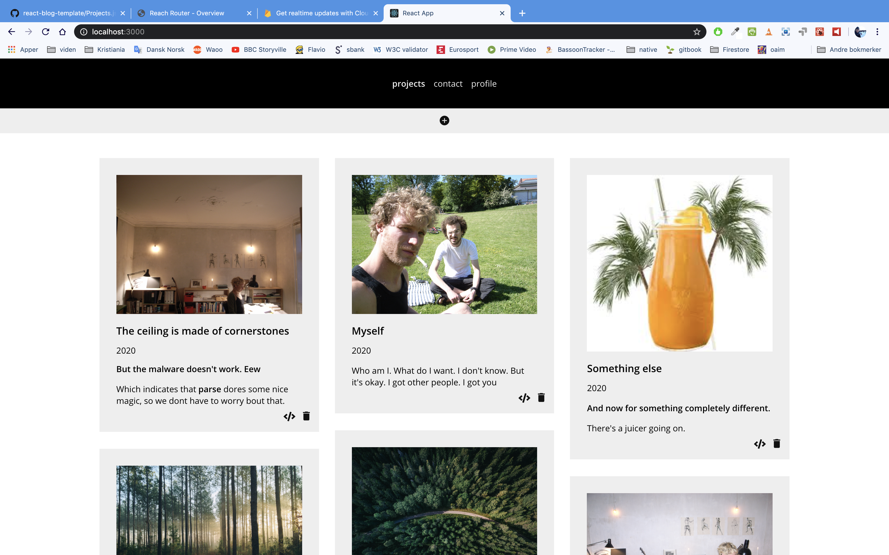

<a href='https://simmoe.github.io/react-blog-template'>Demo on github pages</a>

The project is bootstrapped with [Create React App](https://github.com/facebook/create-react-app).

# React blog template
This project is made for intermediate react learners, that wants to get a thorough understanding of a React projects full lifecycle. It demonstrates how to build a basic blog CMS with ReactJS and firebase/firestore. The final website displays a list of projects, with options to create, edit and delete them. Only the authenticated user can modify the database, everyone can see. 

* Template: create-react-app
* Backend: Google Firebase.firestore
* Routing: Reach Router
* Authentication: Google (redirect) - only one specific person can update, delete and create projects

Of course you can't edit, create or update projects in the demo. But if you like the project, go ahead and fork it. Then you  can exchange the firebase keys in the code and create your own blog from there - tutorial below.

## Step-by-step tutorial
Is not the purpose of this readme. But I will go through the main concepts assuming *some* knowledge on React. The Firebase part in the beginning however, is thorough - so if you havent used React in conjunction with Firebase before, youy should be able to get well started, following this tutorial. 

The project is bootstrapped with [Create React App](https://github.com/facebook/create-react-app). In short that means the first thing you should do, is to open your terminal and change directory to the folder you want the project to reside in. After that, simply type

````javascript
npx create-react-app react-blog-template
````
This command will install a new React project for you, with a set of default pages - open this folder in your favorite code editor. Now open the terminal again and type 

````javascript
npm start 
````
And you will see that your default browser opens with the app frontpage. From here on we will write the app ourselves. Open the file src/App.js and we are ready to setup a connection to firebase.

This project is going to host it's data in Google Firestore. Therefore we will set up a Firestore project right away and put in some test data. 

## Google firestore database
Firestore is a relatively new way to keep and modify data online. In this first basic tutorials we will look at the most simple use case: create a simple data structure and make a webpage that allows users to add new data. Later on we will go on to more advanced features.

Essentially firestore is a database that is hosted in the cloud. As such this doesn't separate it from most other databases - most often you need a database exactly to store data for your webpages, apps or whatever. But when you think about it, there are lots of offline or enclosed local databases. Every desktop app, from text-editors to economy systems - needs databases as well.

### Setup the new database 
Setting up a project in Firestore is pretty straight forward and well documented in <a href='https://firebase.google.com/docs/firestore/quickstart'> this tutorial</a>, but we'll go quickly through it here. Once the project is set up, we will make a small standard webpage (html and css), that establishes a connection so we can read and write data. 

### Simple web client set-up  

-  Setup a new Firestore project (call it web-firestore or similar)
-  Choose Google Analytics and bind it to a new account - its important that you choose Norway or some other location in Europe at this point - accept all terms 
-  Now head into the database tab, and create a new database
-  Choose eur3 as location
-  Since we are just experimenting for now, choose "start in test mode"

We now have a database setup and are ready to start building. Let's start off by creating a test collection - we will call it books - and add a new document, with a title, author and published fields. 

As you can see, in Firebase data are organized in collections, that store documents with fields. We create the document and give it fields right away, notice the field types - a number must be a number, a string a string and so forth. We will get much back to these elements in a short while.

Now head back to the firebase console, and choose *add new web App* to project. An app is the actual code be are about to write - some webpage that carries the relevant javascript that allows us to access and interact with the database. 

-  Set a relevant name like web-firestore-intro-app. 
-  Skip Firebase hosting at this point. 

We are now presented with a Firebase SDK script. This is the necessary variables to get us connected to the actual cloud database. We will copy this script and add it to our React project.

Go ahead and create a new folder in the React project called *components*, create a file called *firebase.js* and paste the scripts. The finished page should look like this:

````javascript
import firebase from 'firebase'

var firebaseConfig = {
    apiKey: "XX",
    authDomain: "XX",
    databaseURL: "XX",
    projectId: "XX",
}
// Initialize Firebase, firestore and authentication
firebase.initializeApp(firebaseConfig)

export default firebase
````
For this to work, you need to add the firebase NPM library to the project - all the nescessary scripts to make firebase run. Open the terminal again - get out of the running process by typing ctrl-space - and install firebase to the REact app like
````javascript
npm install firebase --save
````
### What does all this mean?
The new file firebase.js first imports the firebase library - which is made possible by the last terminal command, that fetched the library into our project. The firebaseConfig constant is a JSON object that containts the nescessary info, to connect to firebase in the cloud. *firebase.initializeApp(firebaseConfig)* uses this object to make the actual connection. When this is done this little page exports the firebase constant so we can use it in the remaining app - lets go ahead and import it in our App.js file, so we can see that the connection is really made and working. 

### Firebase Rules: authentication and authorization
For now anyone can add, edit or delete documents in the database. We don't want that. For this application - a personal blog - only a single user should be able to modify documents, while anyone of course can see them. This requires to steps:

#### Authenticate 
Authentication means *identifying* a user. This is done using a function in the firebase.auth object called an AuthProvider - check src/login.js for details. But first we need to enable this authentication method in the firebase console. Hit Authenticastion and enable Google authentication. Here you can see the many different ways you can authenticate yourself to firebase and once you get the hang of it, it's very easy. You also apply scope - that is - what information on the user do you want tyo allow the application to fetch? In this case email and profile info - so that we can show stuff like Google displayname and user image. The auth process is done via a popup - which is convenient since we dont need to setup a callback url etc. The user is shown a popup using a Google sign in form, accepts to share profile info in the app, and when this succeds a user object is returned to the project.

This project contains a *token* - en encrypted string that contains among other things, a reference to this unique Google user. The smart thing is that this token is *temporary*. It connects the client to Google authentication for a period of time - then it expires and we will need to login again. 

When the authentication is done, we idewntify it with a *listener* in App.js - firebase.auth.onAuthStateChanged(...). This is really smart, becsuse that means we can always detect globally whether the user is signed in or not (authStateChange also happens on logout). App.js sets up a authState listener in useEffect (first thing) and the user login status is then saved in a state variable - isSignedIn[true/false]. This variable is asgain passed down as a prop to the subsequent modules - check out for instance how this is used to handle what HTML to parse in Login.js itself.

#### Authorize
Authentication however only means we now *know* the profile info of someones google account. Anyone can actually login to the page as it is - try it out - but only the user with exactly my Google email, can edit, update or delete the database documents. This is solved through a compination of the access token, and the database rules in firestore. Go ahead and choose database/rules in firebase - mine are set as follows, but of course the documentation allows much more complex authorization as well - check the docs. 

````Javascript
rules_version = '2';
service cloud.firestore {
  match /databases/{database}/documents {
    match /{document=**} {
      allow read: if true;
      allow create, update, delete: if request.auth.token.email.matches("MYUSERNAME@gmail.com");
    }
	}
}
````
So anyone who - logged in or not - tries to modify the database from the app, will receive an error, unless they are logged in to my Google account. 

## Routing
The webpage has a small menu and three "subpages". A React app don't really have subpages however - we just switch between showing components. This process is called *Routing*. This project uses a project called reach/router - <a href="https://reach.tech/router">check out the excellent documentation, and also see how it is done in App.js and Header.js.</a>

## Show projects - Projects.js and Project.js
The architecture to show the project list is standard component based: A top component called Projects.js fetches the documents from the database and save them in state. It then runs through the list of projects using the Array.map() function, and parses each one in a subcomponent called Project.js.

### Okay, so how do we get the project list from the database?
In the database we have one *collection* called 'projects', inside that the actual projects (in Firebase lingo called documents) reside. One very smart feature of Firebase is that instead of fetching the projects collection *once*, we set up a realtime *listener* that will be invoked whwenever changes happen to the collection. This is done in Projects.js: useEffect(): 

````Javascript
const [projects, setProjects] = useState([])

    useEffect(() => {
        firebase
            .firestore()
            .collection('projects')
            .orderBy('year', 'desc')
            .onSnapshot(snapshot => 
                setProjects(snapshot.docs)
            )
    }, [])
````
First we set up a state variable and a corresponding set function called projects (since projects is a state hook, we use setProjects to change its value). In useEffect - the first thing that happens when the Projects module is instantiated - a firestore *listener (.onSnapshot)* is set up. Since this snapshoot is also returned immediately, we simply use setProjects() to include the docs from the collection right away. 

There are many small details to how this process is handled - read the code carefully or the Firebase docs, to get the picture. One thing I should mention however is the *format* of the returned snapshot. It is *not* a simple JSON object

````javascript
projects.map(
  doc => 
  <Project key={doc.id} id={doc.id} project={doc.data()} signedIn={props.signedIn}/>
)
````
-  to get the document id, use doc.id
-  to get the actual fields and values object, use doc.data() 

### A note on Masonry.js
In projects.js you will notice a strange *wrapper* around the actual projects called Masonry. Masonry is a neat js/css projects that makes a nice flexible layout around a set of elements so they can have different sizes in a grid, like 



In order to get Masonry into the project, import the lib via npm:

````javascript
npm install react-masonry-css
````
Then import the lib into the component where you want to use it (here, projects.js)
````javascript
import Masonry from 'react-masonry-css'
````
And lastly use the new component (Masonry) to create the grid - don't forget to add styles as well, for instance to App.css or a Projects.css file. <a href="https://www.npmjs.com/package/react-masonry-css">Check the Masonry css react docs.</a>

## Edit projects - Edit.js
If the user is signed in, Project.js shows a small icon on each entry, that links to a path called /edit/[projectid]. This Routing concept is very smart, and comes from reach/router. In App.js you can see how the Router is setup to catch any path, that corresponds to /edit + some id string:
````javascript
<Edit path={'/edit/:id'} />
````
This means that the component in Edit.js will catch all these links, and at the same time get a reference to that specific document in the database. Getting that parameter is ridiculously simple: it resides in the components *props.id* property. With that id in hand, we can easily fetch the document data from Firebase, in useEffect():

````javascript
const [project, setProject] = useState() 
useEffect( () => {
    window.scrollTo(0, 0)       
    firebase.firestore().collection('projects').doc(props.id)
        .onSnapshot(snapshot => {
        setProject(snapshot.data())
    })
}, [props.id])
````
### Binding form field values to state
Now that we have the project data, we can build a standard HTML form, where each field carries the data from the database. We use a concept however, very widespread in React, where *any change in each of the form fields, will immediately be reflected in the components state*. What!? Well, check the form fields in Edit.js - they all have an onChange function, that generically and immediately invokes setProject() and updates the component state object. 

````javascript
const updateValue =  
//e.persist makes the element visible in the callback function
//the spread object syntax is JSX - makes the given value of post stay, while we update this value
    e => {
    e.persist()
    setProject(prevProject => ({
        ...prevProject,
        [e.target.name]: e.target.value
    }))
}
````
At the same time, we must grasp a very important concept to Google firestore: *There is no scheme for a document. We can add fields to projects as we go along, just by calling the update method on a document:*

````javascript
firebase.firestore().collection('projects').doc(props.id).update(
  { 
    title: 'some title - if a title field exists in the database for this document, its value will be updated (if this new value is different)',
    new: 'an entirely new field will just be added flawlessly to the document'
  }
)
````
The reason this is so smart, is that from now on we can just add any form field we like to the Edit component - the update function will handle whether to add or update new fields. 

### File upload and Firebase Storage
Is handled using a component called react-firebase-file-uploader. The implementation is quite straightforward, but we need to come around the conecept of storage in Firebase to understand how the module actually works. So storage is a plce in Forebase where you can save actual files - so files are not stored directly in collections and documents, instead they are saved in storage, and linked to collections and documents with a URL. 

First enable Storage in the Firebase console. Then you can use the <a href="https://firebase.google.com/docs/storage">Storage api</a> to see how you manage uploading, getting a reference URL and lastly inserting that URL in a database document. See Edit.js for a working example. 


### Saving projects
Is simply handled using Firebase.Firestore update() method as mentioned before. 

## Creating image thumbnails using Firebase functions
Firebase functions is the last concept used in the app. It is a set of server functions that Firebase provides - they can be used for a variety of things, in conjunction with the Firebase Machine Learning suite it can be a really powerful tool. In this project a serverside function is needed to create an image thumbnail every time a new image is uploaded.  

The concept here is: a local client browser can't 'do stuff with files' - like rescaling pictures in this case. But the server can! Of course Google can add a service to their Firebase server, that ie downscales a picture as soon as its uploaded. This is excactly what we want Firebase to do in this project, so we can insert some sort of websafe image on the page even thogh we upload some monstersized image from the desktop. This is handled with Firebase functions. Follow the guide in the Firebase console. 

### Checklist
following https://www.youtube.com/watch?v=OKW8x8-qYs0

-  curl -sL https://firebase.tools | bash //install firebase CLI tools
-  firebase init //answer stuff
-  cd functions // go into the functions dir
-  npm i @google-cloud/storage  //install google cloud stuff
-  npm i sharp //install the image library
-  npm i fs-extra
